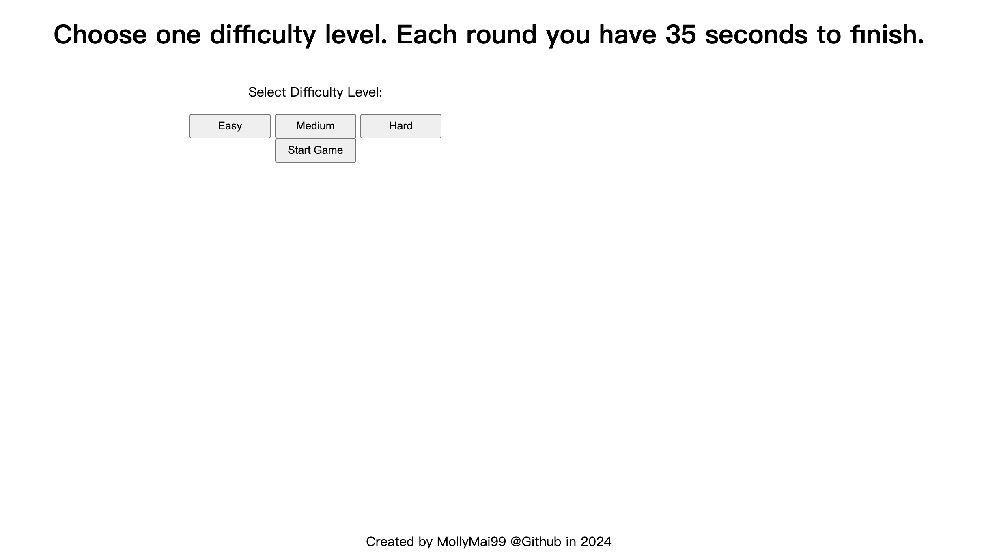
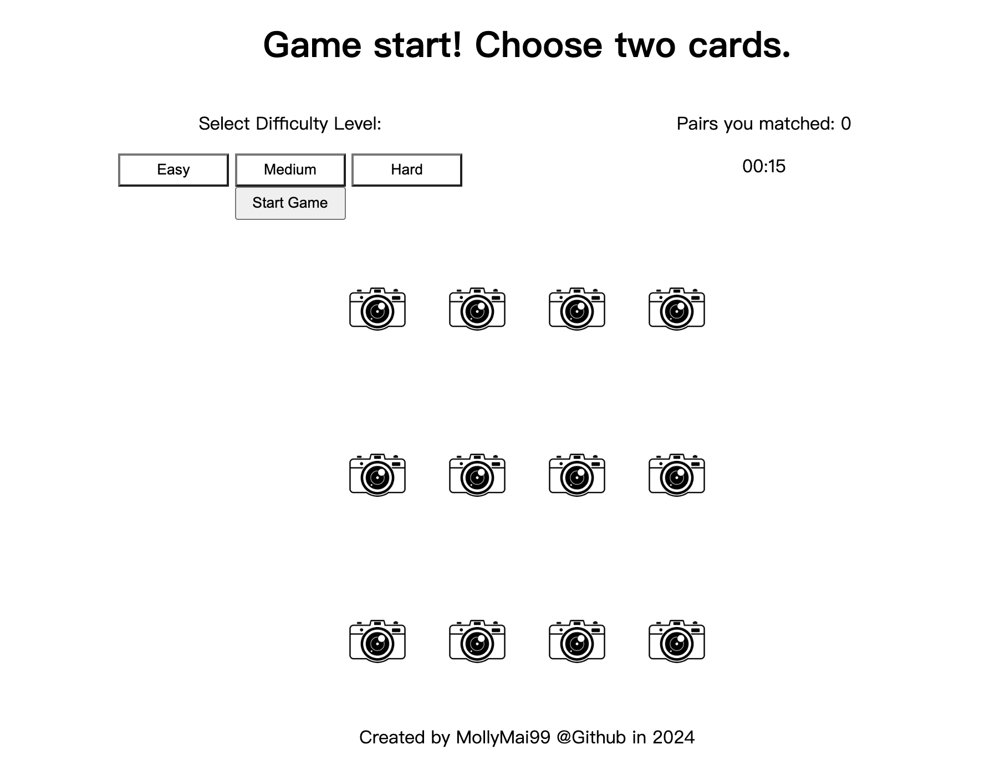
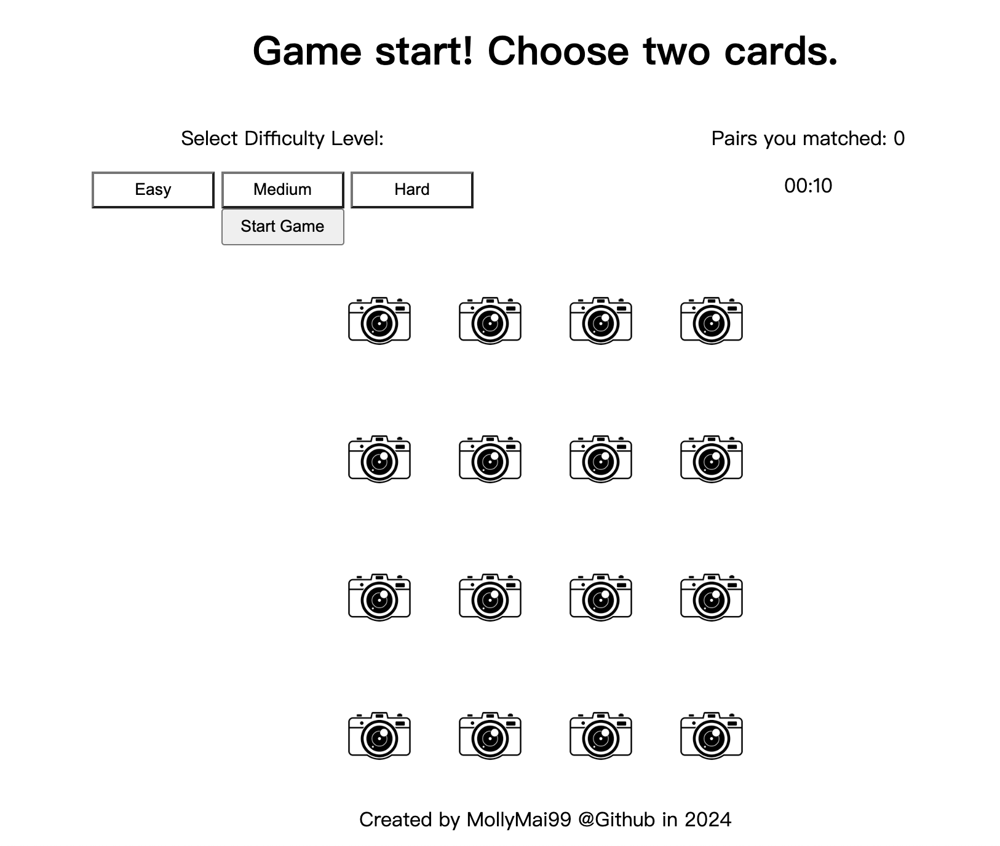
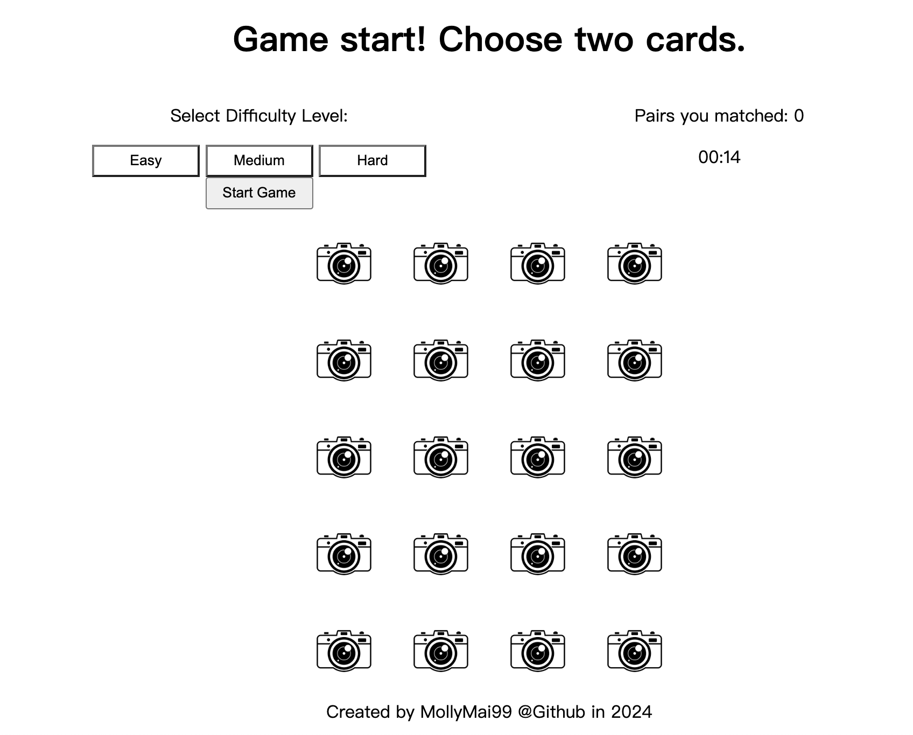

# Memory Game

Welcome to the Tourist Attraction Memory Game! This is a classic memory matching game where players flip cards to reveal images of famous tourist attractions. The goal is to match pairs of identical attraction cards within a limited time. With three difficulty levels and a variety of tourist attractions to explore, this game offers entertainment for players of all ages.

## Screenshot(s)!!

- **Homepage**
  

- **Easy Level**
  

- **Medium Level**
  

- **Hard Level**
  

## Features

- **Three Difficulty Levels**
  _Easy_: Perfect for beginners, featuring a smaller grid.

  _Medium_: Moderate challenge with a larger grid.

  _Hard_: The largest grid with the most cards.
  Tourist Attraction Theme: Explore famous landmarks and destinations from around the world.

- **Timer**: Keep track of your time as you match pairs of cards. Try to complete the game within the shortest time possible to challenge yourself.

## How to Play

1. Choose a Difficulty Level: Easy, Medium, or Hard.
2. Click Any Two Cards to reveal the images underneath.
3. If the Images Match, the cards disappear. If not, the cards flip back over.
4. Continue Flipping Card Pairs until all matches are found.
5. Complete the Game Within the Allowed Time to win.

## Technologies Used

Our memory game utilizes a combination of modern web technologies and methodologies to deliver an engaging and seamless gaming experience. The key technologies and methods employed in the development of this game include:

- **HTML (Hypertext Markup Language)**: The backbone of our game's structure, HTML is used to create the layout and define the structure of the game interface.

- **CSS (Cascading Style Sheets)**: CSS is employed to style and visually enhance the game interface, ensuring a visually appealing and cohesive design across different devices and screen sizes.

- **JavaScript**: As the core programming language of the web, JavaScript powers the interactive elements and gameplay logic of our memory game. It enables dynamic content generation, user interaction, and event handling.

- **DOM (Document Object Model)**: The DOM is a programming interface for web documents, providing a structured representation of the game's HTML elements. JavaScript interacts with the DOM to dynamically update the game interface based on user actions and game events.

- **MVC (Model-View-Controller)**: Our game follows the MVC architectural pattern, separating the application logic into three interconnected components:

  - **Model**: Represents the data and state of the game, including the grid of cards, their statuses, and match logic.

  - **View**: Renders the game interface based on the current state of the model, ensuring that changes in data are reflected visually to the player.

  - **Controller**: Handles user input and interaction, updating the model and view accordingly to maintain the game's state and flow.

## Game Link

You can play the memory game [here](https://memory-game-gamma-six.vercel.app/).

## Next Steps

Add more themes for players to choose from.
